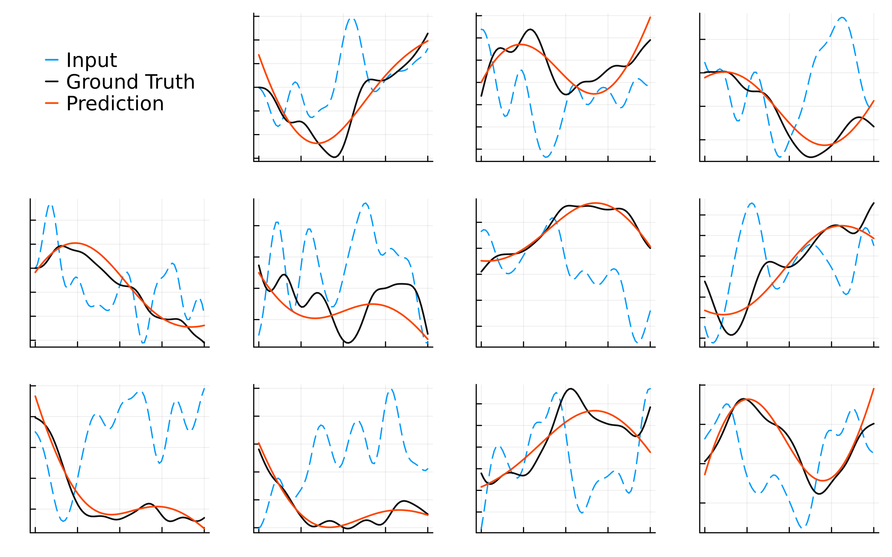

# Extended DeepONet in Julia

DeepONet is a neural network architecture designed for operator learning, which
involves mapping functions to functions. This approach is particularly effective
for problems in infinite-dimensional spaces, such as solving partial
differential equations (PDEs) or modeling scientific simulations.


This implementation extends the standard DeepONet architecture by adding
additional layers after combining the branch and trunk network outputs.

## Neural Operator Learning

Operator learning uses machine learning to approximate mathematical operators.
Unlike traditional machine learning methods that work with finite-dimensional
data, operator learning addresses transformations in infinite-dimensional
spaces, making it essential for solving PDEs and other function-based tasks.

### Universal Approximation Theorem for Operator

[<https://arxiv.org/pdf/1910.03193>]: ... $G$ is a nonlinear continuous
operator. Then for any $\epsilon>0$, there exist *parameters* such that the
following equation holds for all $u$ and $y$:

```math
\left|G(u)(y) - \sum_{k=1}^p
\underbrace{\sum_{i=1}^n c_i^k \sigma\left(\sum_{j=1}^m \xi_{ij}^ku(x_j)+\theta_i^k\right)}_{branch}
\underbrace{\sigma(w_k \cdot y+\zeta_k)}_{trunk}
\right|<\epsilon
```

## DeepONet Architecture


DeepONet consists of:

- **Branch Network**: Processes input functions.
- **Trunk Network**: Processes spatial or temporal coordinates.

The outputs of these networks are combined to approximate the target operator.

## Installation

To install the package:

```julia
pkg> add https://github.com/B0B36JUL-FinalProjects-2024/Project_chutommy
```

## Usage

This extended DeepONet implementation in Julia provides a robust framework for
operator learning.

```julia
model = DeepONetModel( M, 2, 20, activations;
    branch_sizes = branch_sizes,
    trunk_sizes = trunk_sizes,
    output_sizes = output_sizes,
)

opt_state = Flux.setup(Flux.AdamW(0.0003), model)
train!(model, opt_state, train_loader, test_loader)
```

Refer to the provided examples for specific applications.

## Examples

### Integration on [0, 1]

Train DeepONet to approximate the operator for integration over $[0, 1]$:

```math
F(x) = \int_0^1 f(x) \, dx
```

The network learns to compute the integral of a given function \( f(x) \) over
this interval. Predictions are compared with exact ground truth values.


Refer to the code [here](https://github.com/B0B36JUL-FinalProjects-2024/Project_chutommy/blob/main/examples/integrals.jl).

### Burger's Equation

Approximate the solution to the 1D Burger’s equation:

```math
\frac{\partial u}{\partial t} + u \frac{\partial u}{\partial x} = \nu
\frac{\partial^2 u}{\partial x^2}
```

DeepONet is trained on initial conditions to predict the solution over time.


Refer to the code [here](https://github.com/B0B36JUL-FinalProjects-2024/Project_chutommy/blob/main/examples/burgers.jl).

### Darcy's Flow

Learn Darcy’s law for fluid flow in porous media:

```math
\mathbf{v} = -\frac{\kappa}{\mu} \nabla p
```

Given inputs like permeability ($\kappa$) and pressure gradient ($\nabla p$),
the network predicts fluid velocity ($\mathbf{v}$).


Refer to the code [here](https://github.com/B0B36JUL-FinalProjects-2024/Project_chutommy/blob/main/examples/darcys.jl).
